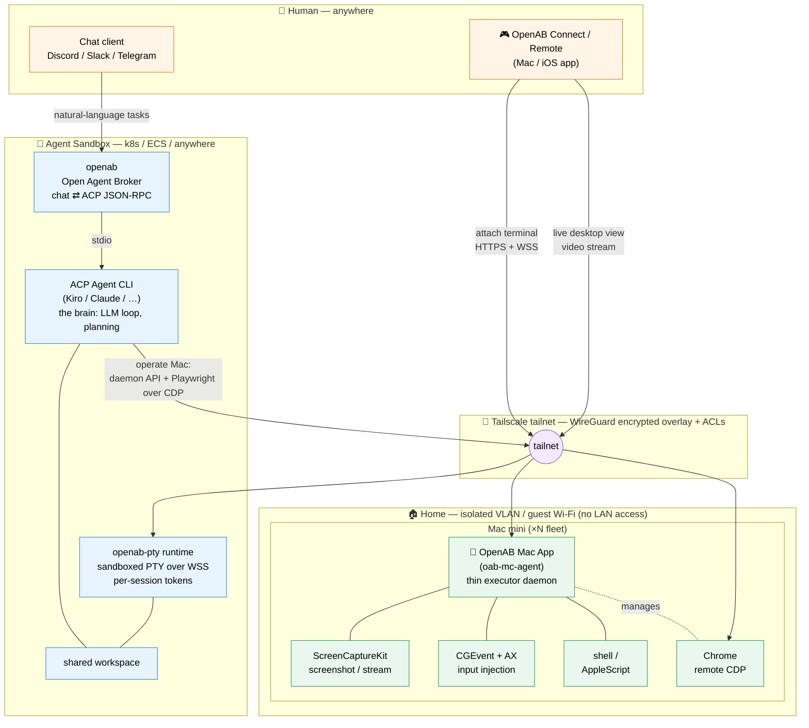

# ADR: OpenAB Mac Agent — Cloud Brain (k8s) + Thin macOS Executor over Tailscale

- **Status:** Proposed
- **Date:** 2026-09-30
- **Author:** @pahud
- **Tracking issue:** [#1544](https://github.com/openabdev/openab/issues/1544) — requested by Pahud (Discord thread, 2026-09-22)
- **Related:** [ADR: openab-pty — Composable Runtime for Remote Sandboxed Terminals](./openab-pty-runtime.md), [ADR: Multi-Platform Adapter Architecture](./multi-platform-adapters.md), [ADR: iMessage Integration via macOS Gateway](./imessage-integration.md) (macOS-native precedent), [Tailscale Integration](../tailscale.md), [ADR: ECS Control Plane](./ecs-control-plane.md)

---

## 1. Context & Problem

A distinct user need exists that OAB's chat-driven ACP model does not serve:

> "I want an AI agent that can fully operate a fresh Mac mini at home — browser automation, GUI control, shell — and I want to drive it from anywhere."

Running the agent brain directly on the Mac mini couples the LLM loop's rollout cadence to a physical machine the operator must babysit, and exposes the tailnet's most privileged endpoint (an autonomous GUI driver) on hardware sitting inside the home. The inverse split solves both: keep the **brain** in a sandbox (k8s / ECS / anywhere) where it can be redeployed independently, and keep the Mac mini as a **thin executor daemon** that rarely changes.

macOS imposes hard constraints that shape the design:

- GUI automation (ScreenCaptureKit, CGEvent input injection, AppleScript) requires a process running in the **Aqua user session** — it cannot run in a container or as a LaunchDaemon.
- TCC permissions (Accessibility, Screen Recording, Automation) **cannot be granted programmatically** — a one-time manual setup step is unavoidable.
- Chrome DevTools Protocol (CDP) has **no built-in authentication** — exposing it on a network requires external isolation.

---

## 2. Decision

Adopt a strict **brain/body separation** with three cleanly separated roles. Every cross-boundary edge goes through a Tailscale tailnet (WireGuard-encrypted overlay + ACLs).

| Role | Component | Runs |
|------|-----------|------|
| 🧠 Brain | **Agent** (via `openab` broker) + `openab-pty` for human shell access | Sandbox — k8s / ECS / anywhere |
| 🎮 Remote control | **OpenAB Connect / Remote** (Mac / iOS app) | Wherever the human is |
| 🦾 Hands & feet | **OpenAB Mac App** (`oab-mc-agent`) | Mac mini fleet on isolated home VLAN |

### Design principle: brain/body separation

- **Mac mini side stays thin**: a pure executor daemon that rarely changes. All intelligence (LLM loop, task orchestration, retry strategy) lives in the sandbox and can be rolled out independently.
- **Browser control is native to this split**: Chrome runs on the Mac mini with `--remote-debugging-port`; the sandboxed agent drives it directly via `playwright.connectOverCDP("http://<tailnet-ip>:9222")`. No custom protocol needed for browser tasks.

---

## 3. Components

### 3.1 Network — Tailscale

- Mac mini: system Tailscale app.
- Sandbox: preferred options in order — (a) `tsnet` embedded in the agent binary (userspace, no privileged pod), (b) Tailscale Kubernetes Operator, (c) `tailscaled` sidecar. The existing [Tailscale integration](../tailscale.md) already proves the unprivileged userspace-`tailscaled` pattern works in OAB containers (ECS Fargate, k8s without `NET_ADMIN`, OrbStack) with per-pod node identity and S3-backed state persistence.
- Ephemeral + tagged auth keys so pods auto-join the tailnet on recreation.
- **ACLs are mandatory**: CDP and the executor daemon have no built-in auth. Lock ports to the agent pod's tag. Add a shared-token check in the daemon as a second layer.

### 3.2 Mac mini — OpenAB Mac App / `oab-mc-agent` (Swift)

- LaunchAgent (must run in the Aqua user session for GUI access — not a LaunchDaemon).
- WebSocket (or gRPC) server bound to the tailnet IP.
- Capabilities:
  - Screen capture: ScreenCaptureKit (`SCStream`) — on-demand screenshots + optional live stream.
  - Input injection: CGEvent + Accessibility (AXUIElement) for non-browser GUI apps.
  - Shell / AppleScript execution.
  - Managed Chrome instance with persistent profile and remote CDP.
- Video pipeline (phase 2): SCStream → VideoToolbox H.264/HEVC hardware encode → WebSocket/UDP → client-side VideoToolbox decode → `AVSampleBufferDisplayLayer` render.

### 3.3 Sandbox — Agent Brain

- Computer-use style LLM loop: screenshot → reason → act.
- Playwright over CDP for browser tasks; daemon API for GUI/shell tasks.
- Handles Mac-offline detection, task pause/resume, retries.
- `openab` brokers chat-driven instructions; `openab-pty` gives the human a sandboxed shell beside the agent workspace (see [openab-pty runtime ADR](./openab-pty-runtime.md)).

### 3.4 OpenAB Connect / Remote (Swift native, macOS/iOS)

- Connects to the sandbox for task submission, status, and terminal attach (via `openab-pty`).
- Connects directly to the Mac mini over the tailnet only when live desktop view is needed.
- Swift chosen over Tauri: native VideoToolbox decode for streaming, shared Codable protocol models with the daemon, and a free path to an iOS client.

---

## 4. Isolation & Hardening (defense in depth)

1. **VLAN / guest Wi-Fi isolation** — Mac minis live on a dedicated home network segment that cannot reach any other hosts on the home LAN. A compromised Mac mini can't pivot into the home network.
2. **Tailscale ACLs** — only tagged agent pods can reach the executor daemon / CDP ports.
3. **Daemon shared token** — last line of defense on the API itself.

This makes the Mac minis behave like disposable "compute appliances" — safe to let an autonomous agent drive them.

---

## 5. macOS Setup (one-time, manual by design)

TCC permissions cannot be granted programmatically; a setup wizard should guide:

- Accessibility, Screen Recording, Automation, (optionally) Full Disk Access.
- Auto-login enabled, screen lock/saver disabled so the GUI session stays alive.

---

## 6. Known Constraints / Risks

- **Latency**: screenshot → sandbox → LLM → action round trip; acceptable when the tailnet gets a direct (hole-punched) connection, worse via DERP relay.
- **CDP is unauthenticated**: mitigated by Tailscale ACLs + daemon token.
- **Session lock**: locked/logged-out GUI session breaks input injection; requires auto-login config.

---

## 7. Phased Plan

1. **PoC**: minimal daemon — WebSocket server + shell exec + on-demand JPEG screenshots; use built-in macOS Screen Sharing over Tailscale for live view.
2. **Browser automation**: managed Chrome + CDP, agent drives via Playwright from the sandbox.
3. **GUI automation**: CGEvent/AX injection driven by the LLM loop.
4. **Productize**: VideoToolbox streaming pipeline integrated into OpenAB Connect/Remote; multi-Mac fleet support.

---

## Consequences

### Positive

- Agent brain iterates independently of the physical fleet — redeploys, scaling, and LLM-loop changes never touch the Mac minis.
- Browser automation needs no custom protocol — Playwright's stock `connectOverCDP` is the entire integration.
- The executor daemon is small enough to audit fully; its attack surface is one authenticated WebSocket bound to the tailnet.
- Mac minis become disposable appliances — a compromised unit cannot reach the home LAN (VLAN) or other tailnet nodes (ACLs).
- `openab-pty` reuse gives the human a sandboxed shell beside the agent workspace with no new component.

### Negative

- Every agent action pays a tailnet round trip; DERP-relayed paths make GUI automation noticeably sluggish.
- macOS forces a manual, per-machine TCC/auto-login setup that cannot be automated or imaged away.
- Three new artifacts to build and maintain (`oab-mc-agent` daemon, Connect/Remote app, sandbox networking recipes) before the first end-to-end demo.
- CDP's missing auth means safety rests entirely on network-layer controls — a misconfigured ACL or leaked auth key exposes full browser control.

## References

- [Issue #1544](https://github.com/openabdev/openab/issues/1544) — original design proposal (this ADR transcribes it)
- [Tailscale Integration](../tailscale.md) — unprivileged userspace `tailscaled` pattern for OAB containers
- [ADR: openab-pty](./openab-pty-runtime.md) — sandboxed PTY runtime used for human terminal attach
- [ADR: iMessage Integration via macOS Gateway](./imessage-integration.md) — precedent for macOS-native companion processes
